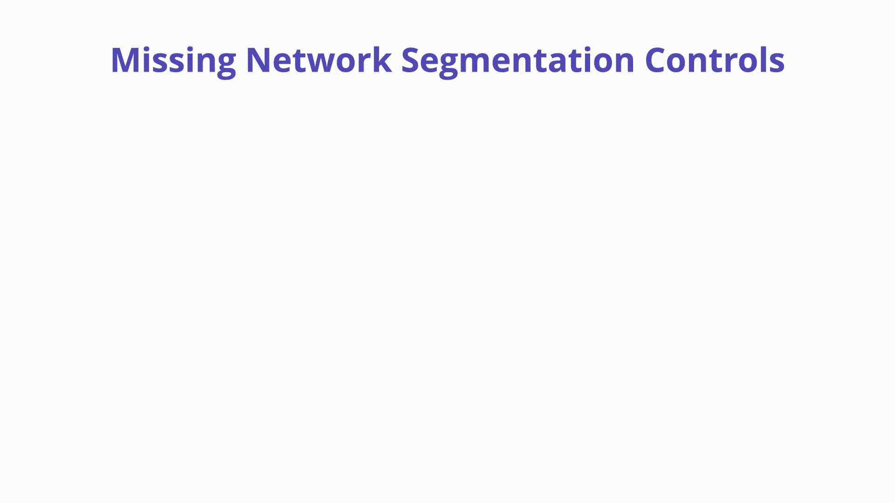
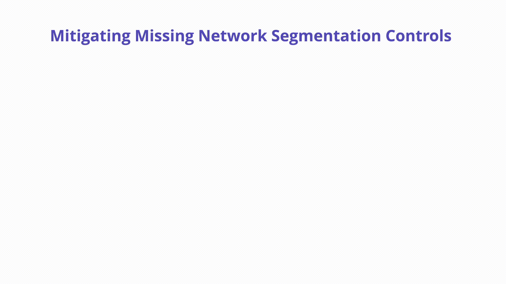

---

layout: col-sidebar
title: "K07: ネットワークセグメンテーションコントロールの欠落 (Network Segmentation)"
---

## 概要
複数のマイクロサービスやテナントで Kubernetes を運用する場合、重要な懸念事項はネットワークトラフィックのコントロールです。Kubernetes クラスタのコンテキスト内でトラフィックを分離することはポッド、名前空間、ラベルなどの間のいくつかのレベルで行われます。



## 説明

Kubernetes ネットワークはデフォルトでフラットです。つまり、追加のコントロールが行われていない場合、どのワークロードも制約なしで別のワークロードと通信できます。実行中のワークロードを悪用する攻撃者は、このデフォルトの動作を利用して内部ネットワークを調べたり、他の実行中のコンテナに移動したり、プライベート API を呼び出したりできます。

## 防止方法
クラスタ内のワークロードはいずれは互いにだけでなく、さまざまな内外のエンドポイントとも通信する必要があります。Kubernetes 内のネットワークセグメンテーションの目標は、コンテナが侵害された場合の被害範囲を最小化し、有効なトラフィックを期待通りにルーティングしながら、ラテラルムーブメントを止めることです。

***ネイティブコントロール (マルチクラスタ)***: Kubernetes 内でネットワークの分離を真に強制するには、適切に個別のクラスタを利用することです。これは密接に結合したマイクロサービスを扱う際には複雑さを増しますが、リスクに基づいて異なるテナントを分離する場合にはありえる選択肢となります。

***ネイティブコントロール (ネットワークポリシー):*** ネットワークポリシーは Kubernetes 自体にビルトインされており、ファイアウォールのルールのように動作します。これぱポッドがどのように通信するかをコントロールします。ネットワークポリシーがなければ、どのポッドも他のどのポッドとも会話できます。ネットワークポリシーはポッドの通信を定義されたアセットのみに制限し、明示的に設定されていないものはすべて拒否するように定義すべきです。以下は "default" 名前空間を実行しているポッド間のバックエンドイーグレスを防ぐネットワークポリシーの例です。

```yaml
apiVersion: networking.k8s.io/v1
kind: NetworkPolicy
metadata:
  name: deny-backend-egress
  namespace: default

spec:
    podSelector:
    matchLabels:
      tier: backend
      policyTypes:
      - Egress
      egress:
      - to:
         - podSelector:
        matchLabels:
        tier: backend
```

***サービスメッシュ:*** さまざまなユースケースに対して [Istio](https://istio.io/), [Linkerd](https://linkerd.io/), [Hashicorp Consul](https://www.consul.io/docs/k8s) などの数多くのさまざまなサービスメッシュプロジェクトが利用可能です。これらのサービスメッシュテクノロジはそれぞれ Kubernetes クラスタ内のネットワークトラフィックをセグメント化するさまざまな方法を提供し、すべてに長所と短所があります。以下は Istio の `AuthorizationPolicy` の例です。

```yaml
apiVersion: "security.istio.io/v1beta1"
kind: "AuthorizationPolicy"
metadata:
  name: "shoes-writer"
  namespace: default
spec:
  selector:
    matchLabels:
      app: shoes
  rules:
  - from:
    - source:
        principals: ["cluster.local/ns/default/sa/inventory-sa"]
    to:
    - operation:
        methods: ["POST"]
```

- **`shoes`** の **`selector`** は **`app:shoes`** でラベル付けされたすべてのデプロイメントを矯正することを意味します。
- 私たちが許可している **`source`** ワークロードは **`inventory-sa`** というアイデンティティを持っています。Kubernetes 環境では、**`inventory-sa`** [サービスアカウント](https://kubernetes.io/docs/tasks/configure-pod-container/configure-service-account/) を持つポッドだけが shoes にアクセスできることを意味します。
- HTTP 操作は **`POST`** だけが許可しており、**`GET`** や **`PUT`** などの他の HTTP 操作は拒否することを意味します。

***CNI プラグイン:***

Container Network Interface (CNI) はネットワークリソースへのアクセスを設定するために使用されるオープンソース [仕様](http://github.com/containernetworking/cni) です。CNI は Kubernetes 内のネットワークアクセスを許可または拒否するためのソフトウェア定義のメカニズムであり、サポートされるプラグインは多岐にわたります。[Project Calico](https://www.tigera.io/project-calico/) や [Cilium](https://cilium.io/) などのソリューションはすべて Kubernetes のコンテキスト内でネットワークトラフィックを分離するためのさまざまなメカニズムを提供しています。オペレータが Kubernetes ネットワークポリシー (上記) を実装したい場合、一般的に CNI が必要となります。

CNI を選択する場合には、セキュリティの観点から求めている機能セットと、そのプラグインを使用することに関連するリソースのオーバーヘッドとメンテナンスについて理解することが最も重要です。



## 攻撃シナリオの例

Wordpress ポッドはネットワークセグメンテーションがないクラスタ上で侵害され、攻撃者はネットワークを探索するために `dig` や `curl` といったネットワークユーティリティを利用できるとします  (結局は Ubuntu ベースイメージなのです)  。彼らは一般的に Redis であるポート `6379` で動作する、内部アクセス可能な API を発見します。彼らは `curl` を使用して、内部でバックエンド API にのみ使用されることを意図していた Redis マイクロサービスをプローブできます。データが盗まれ改変されます。

ロックダウンした `NetworkPolicy` やサービスメッシュ実装では Wordpress などから Redis へのネットワーク接続は不可能だったでしょう。

ネットワークセグメンテーションがないクラスタ上でそれほど重要ではないウェブアプリケーションが侵害されます。攻撃者はメタデータ URL へのリクエストを行い、ブートストラッププロセスのすべての詳細を持つ証明書鍵を含む kube-env ファイルを取得できます。この攻撃は自分自身をノードとして登録し、さらなるエスカレーションのためにシークレットを盗む可能性があります。

以下に記載したシンプルな `NetworkPolicy` でユーザーがメタデータ URL を呼び出すことをブロックできます。

```
apiVersion: networking.k8s.io/v1
kind: NetworkPolicy
metadata:
  name: block-1
spec:
  egress:
  - to:
    - ipBlock:
        cidr: 0.0.0.0/0
        except:
        - 169.254.169.254/32
  podSelector: {}
  policyTypes:
  - Egress
```

## 参考資料

Istio Authorization: [https://istiobyexample.dev/authorization/](https://istiobyexample.dev/authorization/)

Kubernetes CNI Explained: [https://www.tigera.io/learn/guides/kubernetes-networking/kubernetes-cni/](https://www.tigera.io/learn/guides/kubernetes-networking/kubernetes-cni/)

Kubernetes Network Policies: [https://kubernetes.io/docs/concepts/services-networking/network-policies/](https://kubernetes.io/docs/concepts/services-networking/network-policies/)

Hacking kubelet on GKE: [https://www.4armed.com/blog/hacking-kubelet-on-gke/](https://www.4armed.com/blog/hacking-kubelet-on-gke/)
