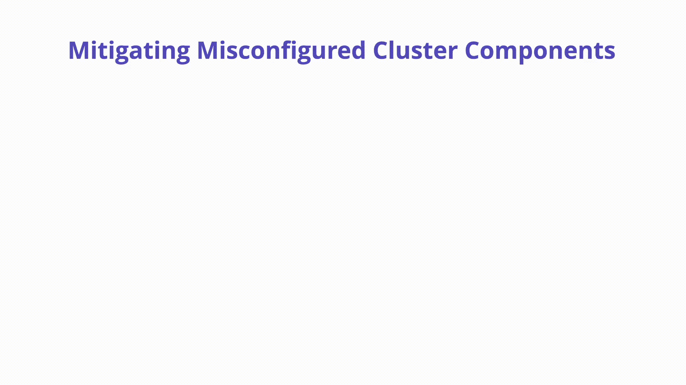

---

layout: col-sidebar
title: "K09: クラスタコンポーネントの設定ミス (Misconfigured Cluster Components)"
---

## 概要
Kubernetes クラスタは etcd 内の Key-Value ストレージ、kube-apiserver、kubelet など、数多くのさまざまなコンポーネントから侵害されます。これらのコンポーネントはそれぞれ高度に設定可能であり、重要なセキュリティ責任を担っています。


## 説明

Kubernetes コアコンポーネントの設定ミスはクラスタの完全な侵害や悪化につながる可能性があります。Kubernetes コントロールプレーンとノード上に存在する、設定ミスを起こしやすいコンポーネントをいくつか探ります。

**kubelet:** クラスタの各ノード上で動作し、コンテナが期待どおりに実行され、正常であることを確認するエージェントです。 kubelet 自体で注意すべき危険な設定は以下のとおりです。

匿名認証では Kubelet への非認証リクエストを許可します。Kubelet の設定をチェックし、以下のフラグが **false** に設定されていることを確認してください。

```bash
#bad
--anonymous-auth=true
#good
--anonymous-auth=false
```

Kubelets と通信する際は常に Authorization チェックを行うべきです。Authorization モードを設定して、明示的に非認可リクエストを許可することが可能です。Kubelet 設定でこのようなことがないように以下を点検してください。モードは **AlwaysAllow** 以外に設定すべきです。

```bash
#bad
--authorization-mode=AlwaysAllow
#good
--authorization-mode=Webhook
```

**etcd:** Kubernetes がすべてのクラスタデータを一元的に格納するために使用する高可用性キーバリューストアです。etcd は設定データだけでなくシークレットも格納するため、安全に保つことが重要です。

**kube-apiserver:** API サーバーは Kubernetes API を公開する Kubernetes [コントロールプレーン](https://kubernetes.io/docs/reference/glossary/?all=true#term-control-plane) のコンポーネントです。API サーバーは Kubernetes コントロールプレーンのフロントエンドです。


実行できる簡単なセキュリティチェックは API サーバー自体のインターネットアクセシビリティを検査することです。最近の [ニュース](https://www.bleepingcomputer.com/news/security/over-900-000-kubernetes-instances-found-exposed-online/) に見られるように、 Kubernetes API をパブリックネットワークから切り離すことが推奨されています。



## 防止方法

手始めとしてコンポーネントの設定ミスに焦点を当てた定期的な CIS Benchmark スキャンと監査を実施することです。 Infrastructure-as-Code の強力な文化は Kubernetes 設定と修復を一元化し、セキュリティチームがクラスタを作成し保守する方法を可視化するのにも役立ちます。EKS や GKE などのマネージド Kubernetes を使用すれば、コンポーネント設定の選択肢をある程度制限し、オペレータをよりセキュアなデフォルトに誘導することも可能です。

## 参考資料

CIS Benchmark: [https://www.cisecurity.org/benchmark/kubernetes](https://www.cisecurity.org/benchmark/kubernetes)

Kubernetes Cluster Components: [https://kubernetes.io/docs/concepts/overview/components/](https://kubernetes.io/docs/concepts/overview/components/)
